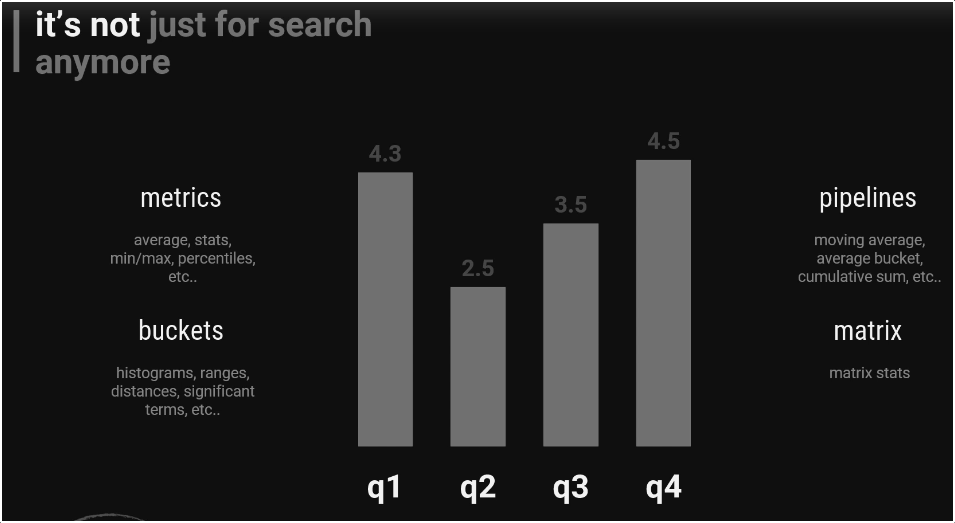
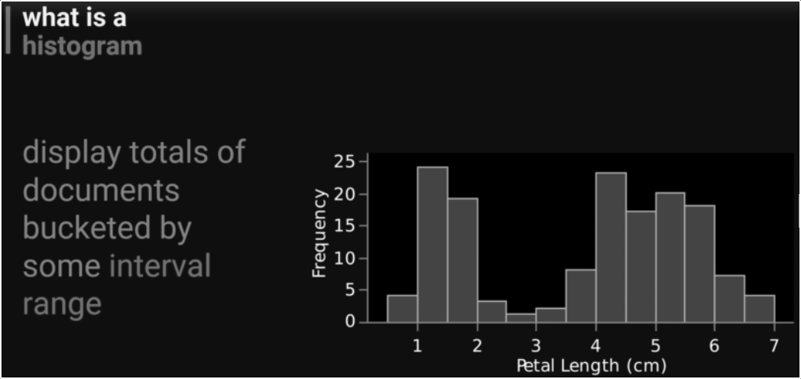

# Aggregations
- [Aggregations](#aggregations)
  - [Average](#average)
  - [Histogram](#histogram)
  - [Times Series](#times-series)
***


## Average
```shell
curl -XGET 127.0.0.1:9200/ratings/_search?size=0&pretty -d
{
	"query":{
		"match_phrase":{
			"title":"Star Wars Episode IV"
		}
	},
	"aggs":{
		"avg_rating":{
			"avg":{
				"field":"rating"
			}
		}
	}
}
```

## Histogram
what it is?

```shell
curl -XGET 127.0.0.1:9200/ratings/_search?size=0&pretty -d
{
	"aggs":{
		"whole_ratings":{
			"histogram":{
				"field":"rating",
				"interval": 1.0
			}
		}
	}
}
```

## Times Series
Elasticsearch can bucket and aggregate fields that contain time and dates properly. You can aggregate by "year" or "month" and it knows about calendar rules.
 ```shell
 curl -XGET 127.0.0.1:9200/logstash-2019.12.01-000001/_search?size=0&pretty -d
 {
	"query":{
		"match":{
			"agent":"Googlebot"
		}
	},
	"aggs":{
		"timestamp":{
			"date_histogram":{
				"field":"@timestamp",
				"interval":"hour"
			}
		}
	}
}
 ```