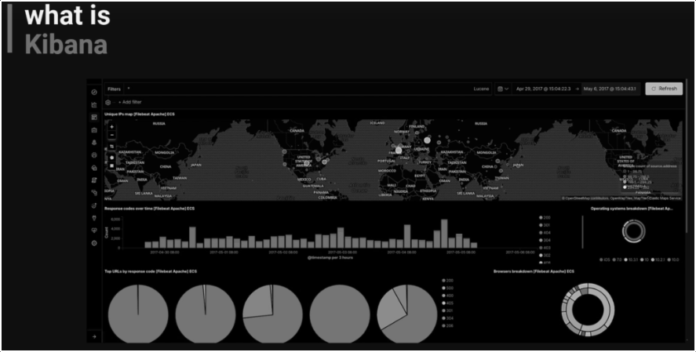

# Kibana
Web UI that puts in tops on Elastic to create dashboards and visualizations.

- [Kibana](#kibana)
  - [Install](#install)
    - [Ubuntu Server](#ubuntu-server)
  - [Start](#start)
***
## Install
### Ubuntu Server
```shell
sudo apt-get install kibana
sudo nano /etc/kibana/kibana.yml
# change server.host to 0.0.0.0
sudo /bin/systemctl daemon-reload
sudo /bin/systemctl enable kibana.service
sudo /bin/systemctl start kibana.service
# Kibana is now available on port 5601
# http://127.0.0.1:5601
```

## Start
```shell
cd /var/lib/grafana/plugins/mongodb-grafana
npm run server
```