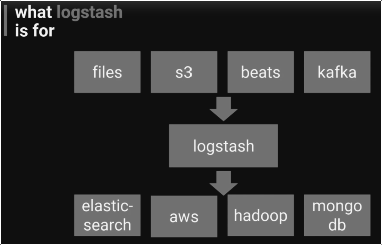
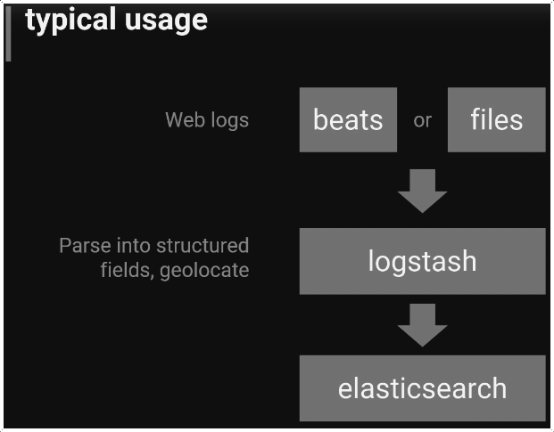

# Logstash
- [Logstash](#logstash)
  - [What it is?](#what-it-is)
  - [Capabilities](#capabilities)
  - [Typical use](#typical-use)
  - [install](#install)
    - [Ubuntu](#ubuntu)
  - [Configure](#configure)
  - [Run](#run)
    - [Simple](#simple)
    - [Ubuntu Server](#ubuntu-server)
***
## What it is?
Tool to move data



## Capabilities
- parses, transforms, and filters data as it passes through
- it can derive structure from unstructured data
- it can anonymize personal data or exclude it entirely
- it can do geo-location
- it can scale across many nodes
- it guarantees at-least-one delivery
- it absorbs troughput from load spikes

[Plug-ins](https://www.elastic.co/guide/en/logstash/current/filter-plugins.html)

## Typical use


## install
### Ubuntu
```shell
sudo apt install openjdk-8-jre-headless
sudo apt-get update
sudo apt-get install logstash
```

## Configure
```shell
sudo nano /etc/logstash/conf.d/logstash.conf
# file
input {
        file {
                path => "/home/brownbull/ELK/logs/access_log"
                start_position => "brginning"
        }
}

filter {
        grok {
                match => {"message" => "%{COMBINEDAPACHELOG}"}
        }
        date {
                match => ["timestamp", "dd/MMM/yyyy:HH:mm:ss Z"]
        }
}

output {
        elasticsearch {
                hosts => ["localhost:9200"]
        }
        stdout {
                codec => rubydebug
        }
}         
```

## Run
### Simple
```shell
# windows
logstash -e "input { stdin { } } output { stdout {} }"
# ubuntu server
cd /usr/share/logstash
sudo bin/logstash -e 'input { stdin { } } output { stdout {} }'
```


### Ubuntu Server
```shell
cd /usr/share/logstash
sudo bin/logstash -f /etc/logstash/conf.d/logstash.conf --config.reload.automatic
# The --config.reload.automatic option enables automatic config 
# reloading so that you don’t have to stop and restart Logstash every 
# time you modify the configuration file.
```